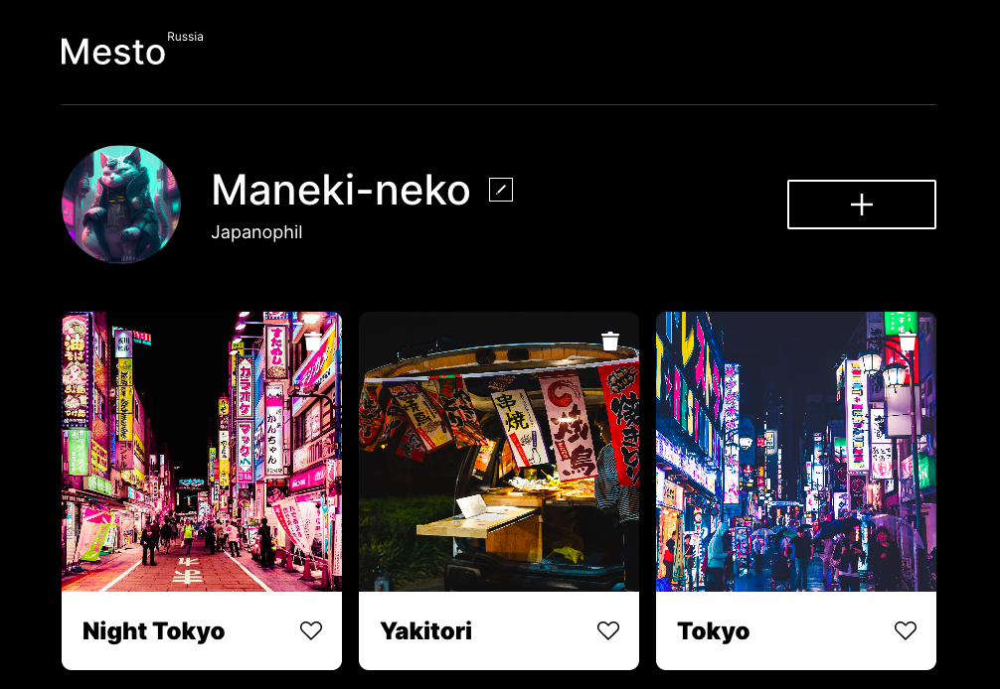

# Проект: Место

## Проектная работа - социальный профиль.

 [Ссылка на проект](https://catherinsmi.github.io/mesto-project/)

В проекте использовались:
 * grid layout & flexbox
 * @ медиазапросы
 * адаптивная верстка под мобильную версию
  
В проекте реализована возможность добавлять свои фотографии, редактировать профиль, ставить лайки :heart:  
